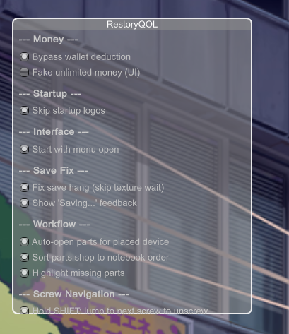
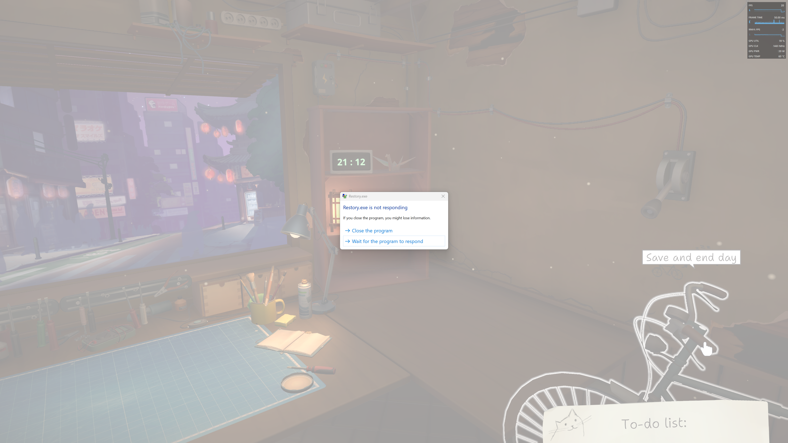
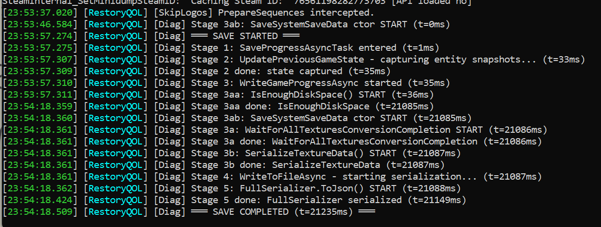

# Azalea's Restory QoL Mod

Happy launch day!

Just made this mod to make the game faster-paced using some QoL improvements (and some bug fixes for the game since it just launched)

## Features

**QoL Improvements**

* Skip startup logos
* Automatically go to the device's part store page when you click on the browser while repairing the device
* Highlight missing parts in part store page

**Cheats**

* Infinite money / bypass wallet deduction

**Bug Fixes**

* Fix the game hangs for ~20 seconds every time I save

## Installation

1. Install [MelonLoader](https://melonwiki.xyz)
2. Download the [Latest Release](./Releases) and put it in the `Mods` folder in game files
3. Launch the game 

## Screenshots

Below are some screenshots of the features

Infinite money / Bypass wallet deduction

Save stuck / fix

