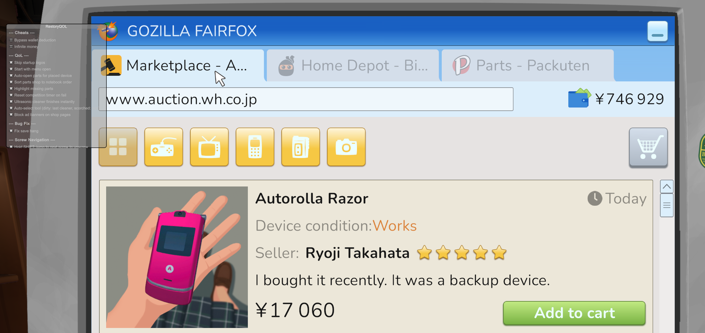
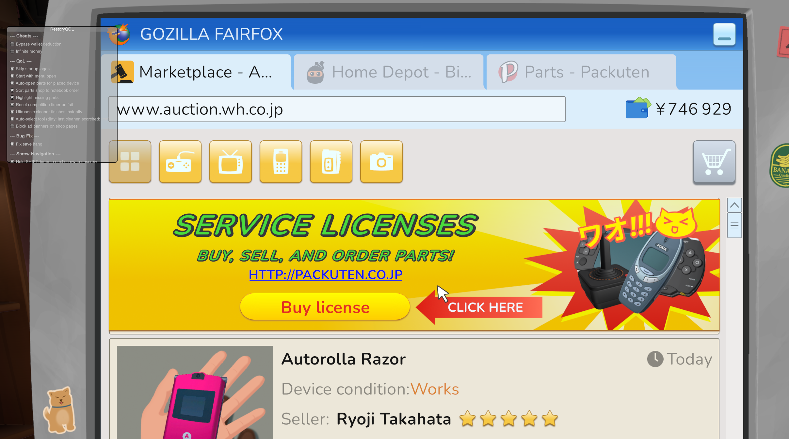
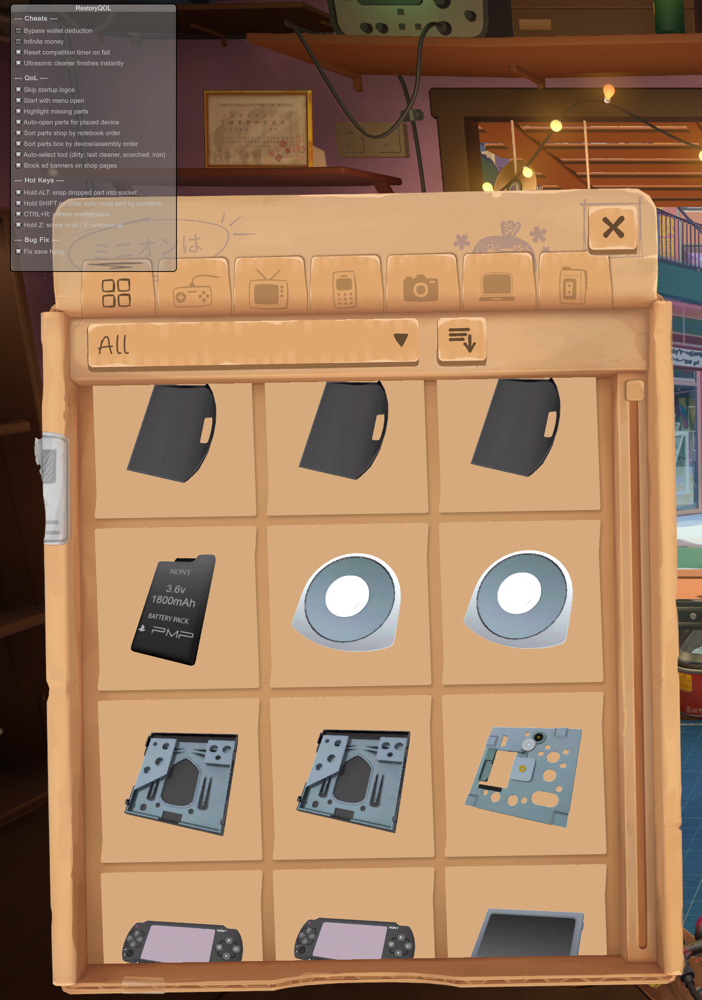

# Azalea's Restory QoL Mod

Happy launch day!

Just made this mod to make the game faster-paced using some QoL improvements (and some bug fixes for the game since it just launched)

## Features

**Cheats**

* Bypass wallet deduction
* Infinite money
* Reset the competition timer when a competition attempt fails
* Ultrasonic cleaner finishes instantly

**QoL Improvements**

* Skip startup logos
* Start with the menu open
* Highlight parts missing from the current device (in the parts shop)
* Auto-open the parts page for the placed device
* Sort the parts shop to match the notebook's part order
* Sort the parts box by device, then assembly order
* Count parts sitting in the ultrasonic bath as "on surface" in the notebook, so they aren't marked as missing parts
* Auto-select the right tool: last used cleaning tool for dirty parts, soldering iron for scorched parts
* Block the ad banners on the in-game browser's shop pages

**Hot Keys**

* Hold ALT: snap a dropped part straight into its socket
* Hold SHIFT on drop: route the part by condition (broken → shredder, dirty → ultrasonic bath, good → parts box)
* Press G: gather every loose part on the work surface back into a tidy grid on the mat (rescues parts stuck out of reach)
* CTRL+R: refresh the marketplace
* Hold Z to screw in all visible loose screws, hold X to unscrew them all

**Bug Fixes**

* ~~Fix the game hangs for ~20 seconds every time I save~~ Fixed by game update

## Installation

### Using MelonLoader (Recommended)

1. Install [MelonLoader](https://melonwiki.xyz)
2. Download the [Latest Release](./Releases) and put the dll in the `Mods` folder in game files
3. Launch the game

### Using BepInEx 6

1. Install [BepInEx 6](https://docs.bepinex.dev/articles/user_guide/installation/index.html#where-to-download-bepinex).  
  Make sure you download "bleeding-edge build" from BepisBuilds. The BepInEx 5.4 or 6.0.0-pre.2 from Github Actions is too old and doesn't support Unity 6000!!!
2. Download the [Latest Release](./Releases) and put the dll in the `BepInEx/plugins` folder in game files
3. Launch the game

## Screenshots

Below are some screenshots of the features

Infinite money / Bypass wallet deduction

Highlight missing parts

Save stuck / fix

Ad block

Sort parts box

Ultrasonic items show up in notebook

Press G to gather parts

